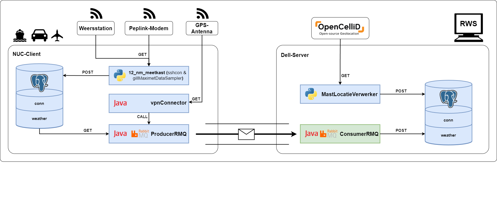

<a id="readme-top"></a>

[![Unlicense License][license-shield]][license-url]

<!-- PROJECT LOGO -->
<br />
<div align="center">
  <a href="https://github.com/RWS-CFNS/ConsumerRMQ">
    
  </a>

  <h3 align="center">ConsumerRMQ</h3>

  <p align="center">
    Retrieves/Consumes data that has been send by a RabbitMQ Producer.
    <br />
    <a href="https://github.com/RWS-CFNS/ConsumerRMQ"><strong>Explore the docs »</strong></a>
    <br />
    <br />
  </p>
</div>


<!-- TABLE OF CONTENTS -->
<details>
  <summary>Table of Contents</summary>
  <ol>
    <li>
      <a href="#about-the-project">About The Project</a>
      <ul>
        <li><a href="#built-with">Built With</a></li>
      </ul>
    </li>
    <li>
      <a href="#getting-started">Getting Started</a>
      <ul>
        <li><a href="#prerequisites">Prerequisites</a></li>
        <li><a href="#installation">Installation</a></li>
      </ul>
    </li>
    <li><a href="#usage">Usage</a></li>
    <li><a href="#license">License</a></li>
  </ol>
</details>


<!-- ABOUT THE PROJECT -->
## System Architecture Overview


This application automates the process of retrieving and transmitting database records to a RabbitMQ message queue. It connects to a PostgreSQL database, extracts relevant data from multiple tables (such as weather, connection, and AIS data), transforms the data into JSON format, and publishes it to a message queue for further processing.

### Key Features:

* **Database Connectivity**: Establishes a connection with a PostgreSQL database and retrieves records from configurable tables.
* **Configurable Data Processing**: Supports configuration-based control over which data sets (weather, connection, AIS) should be retrieved and published.
* **JSON Data Transformation**: Converts SQL query results into structured JSON objects for easy integration with other systems.
* **Message Queue Integration**: Uses RabbitMQ to efficiently distribute data for downstream applications or analysis.

Use the `BLANK_README.md` to get started.


<p align="right">(<a href="#readme-top">back to top</a>)</p>


### Built With

This section should list any major frameworks/libraries used to bootstrap your project. Leave any add-ons/plugins for the acknowledgements section. Here are a few examples.

[![Eclipse][Eclipse.org]][Eclipse-url]
[![Maven][Maven.org]][Maven-url]
[![RabbitMQ][Rabbitmq.com]][Rabbitmq-url]
[![JSON][json.org]][json-url]

<p align="right">(<a href="#readme-top">back to top</a>)</p>


## Getting Started

### Prerequisites

RabbitMQ and PostgreSQL Setup:

* RabbitMQ should be running on the host and ip specified in your config.properties. This application will connect to it to listen for messages.
* PostgreSQL should also be running with the mirrored version of the Producers database on the host and ip + port specified in your config.properties.
* Ensure the correct credentials are provided in the config.properties.

Java Runtime Environment (JRE):

Make sure you have a compatible JRE (Java Runtime Environment) installed, JRE 8 or higher is required.
   ```sh
   java -version
   ```

### Installation

1. Download the latest release from the [Releases Page](https://github.com/RWS-CFNS/ConsumerRMQ/releases) and extract the ZIP file.
2. Configure database and rabbitmq server parameters by updating the configuration file with your credentials:
   ```python
    PostgreSQL Configuratie
    db.url=jdbc:postgresql://<ip>:<port>/<database_name>
    db.username=<username>
    db.password=<password>

    RabbitMQ Configuratie
    rabbitmq.host=<ip>
    rabbitmq.username=<username>
    rabbitmq.password=<password>
   ```
3. Run the script:
   ```sh
   java -jar consumerRMQ.jar
   ```
It will now listen for incoming messages send by the Producer and forward it into the specified database.

## Usage
This application is designed for consuming data from a RabbitMQ message queue, processing it, and storing the results into a PostgreSQL database. It listens for incoming messages in the queue, retrieves the JSON data, and processes it accordingly before inserting the relevant information into the database. The integration of RabbitMQ and PostgreSQL ensures efficient and reliable data handling, making it an ideal solution for applications that require real-time data processing and storage.

<!-- LICENSE -->
## License

Distributed under the Unlicense License. See `LICENSE.txt` for more information.

<p align="right">(<a href="#readme-top">back to top</a>)</p>

<!-- MARKDOWN LINKS & IMAGES -->
<!-- https://www.markdownguide.org/basic-syntax/#reference-style-links -->
[license-shield]: https://img.shields.io/github/license/RWS-CFNS/consumerRMQ.svg?style=for-the-badge
[license-url]: https://github.com/RWS-CFNS/ConsumerRMQ/blob/main/LICENSE

[Eclipse.org]: https://img.shields.io/badge/Eclipse-7E48BD?style=for-the-badge&logo=eclipse&logoColor=white
[Eclipse-url]: https://Eclipse.org/
[Python.org]: https://img.shields.io/badge/Python-1985A1?style=for-the-badge&logo=python&logoColor=white
[Python-url]: https://python.org/
[Opencellid.org]: https://img.shields.io/badge/Opencellid-F09728?style=for-the-badge
[Opencellid-url]: https://Opencellid.org/
[Maven.org]: https://img.shields.io/badge/Maven-6A005C?style=for-the-badge&logo=apachemaven&logoColor=white
[Maven-url]: https://maven.apache.org/
[Rabbitmq.com]: https://img.shields.io/badge/rabbitmq-FF6600?style=for-the-badge&logo=rabbitmq&logoColor=white
[Rabbitmq-url]: https://rabbitmq.com/
[json.org]: https://img.shields.io/badge/json-589632?style=for-the-badge&logo=json&logoColor=white
[json-url]: https://json.com/
